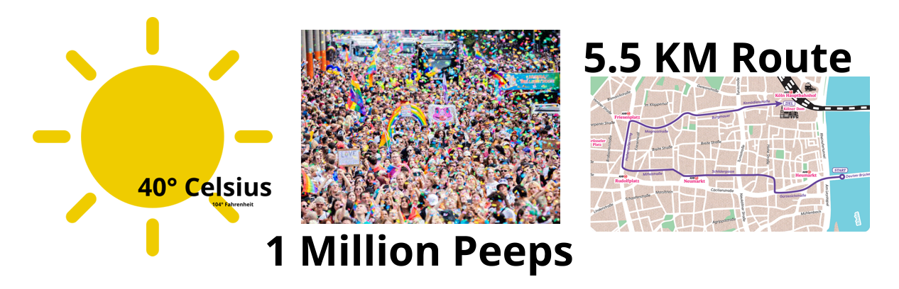
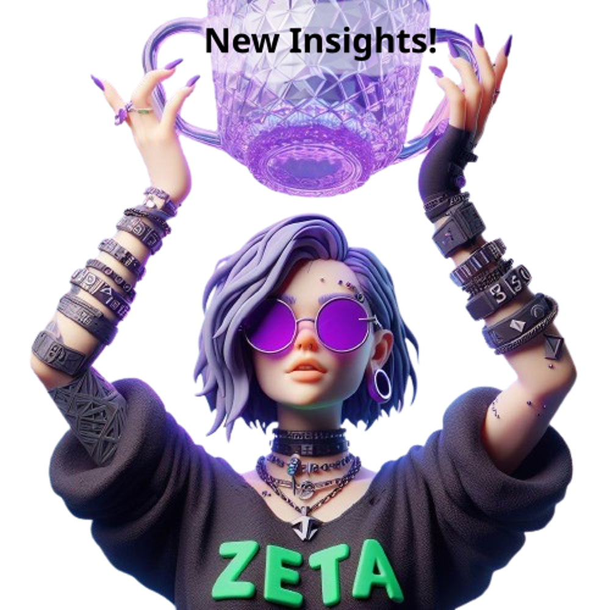
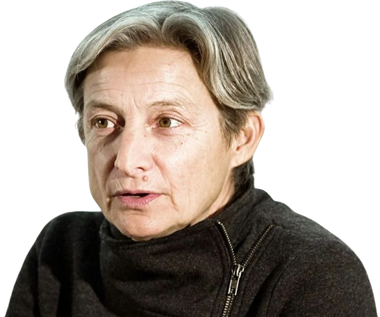
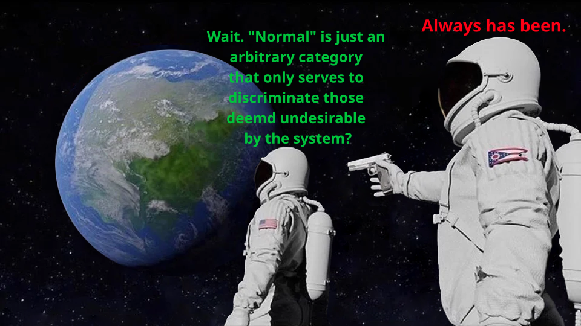

# Bringing Plurality to the Pride

A queer journey about lgbt+oddballs, the power of words and DIY Activism.

<!--
Hello and welcome to my panel.

Today I wanna take ya to a journy of what I have done last summer. Mainly visiting various prides and spreading plural awareness. The subtitle already implies that we will tackle this journey in three parts.

The first part will be about what I have done, why I have done it, and what i got from it.
Theory will be the main focus of the second part, as to understand more fundamentaly what happened here.
And in the third part, I will share some insights and tipps for those who want to follow my example.

---
*Notes* Have ya been on a pride before?
- Yes, once
- Yes, often
- No, never
- No, but I want to
 -->
---

### Potential Triggers

<ul>
    <li>Medicalism and Ableism</li>
    <li>Trans- and Homophobia</li>
    <li>Freud and Rowling</li>
    <li>Gatekeeping</li>
    <li>Death</li>
    <li>Edgy Gay Memes</li>
    <li><b>All triggers are abstract</b></li>
</ul>

<!-- 
Let's start with some trigger warnings.
Since this is a talk about LGBTQ+ Protests and representation, sadly we have to also mention things like Homophobia and Transphobia. Medicalism and Ableism affects the the plural part of this talk.

All of those topics are kept at an abstract level. Meaning, I will mention the existence of for example Medicalism, but I will not go into any details.

I also used memes as one of the themes of this panel. If you prefer a more academic style, I'm sure you will find plenty of other interesting panels in this conference. And I genuinly want you to have a good time.
-->
---

### About me

- Zeta (she/they), part of a trauma-genic system
- Create Music, Code and other sway things.
- LGBTQ+++
- Co-Host of the HAY& Podcast
- Limited Experience with acitvism

Git-Repository: github.com/plural-activism/plural-pride-walk

<!-- 
Name is zeta. I'm member of a chaotic bunch who try to make the best out of our exitence. 
We probably occupy each letter of the LGBTQIAS etc. alphat, except straight, I haven't found that headmate yet.

I see myself as way more than just a headmate, I enjoy stuff like producing music, working on electronics and hope they dont explode and nerd things in general.

We also work on the podcast "How about you?&" a cozy place in which plurals can share their everyday experiences.
I have done some political activism in the past, but neither were plural, nor lgbt, nor anti-ableism. So I started this journay as a noob.

All files of this talk, including some bonus content is publicly available on the github repository with the displayed adress. Yes, I'm a nerd.
 -->
---

## Part 1: The Journey

<!-- In this part I'm describing how this whole journey started, what I have planed, what actually worked out, who I met, how it felt like and what I learned -->
---

## Would ya bring a plural flag to a pridewalk?

<!--
This whole journey started with a simple question:
Would ya bring a plural flag to a pride walk?

I really liked the idea, but I had some doubts if I should do it.
-->
---

### Counterargument

<!--
On the year before, I visisted one of the first "Post"-Corona Prides.
Its been the first Pride in a while, and somethin that bothered me a lot was this:
A truck of a politcal party, making advertisement for themselfs and their "queer-friendliness"
Even if we put aside that the "queer-friendliness" is a relatively new thing, it really bothered me.

In my intuition, prides should be a place where all the gay, trans, queer nerds can meetup and celebrate their existance. Its a space of defiance. Certainly not one for advertising a thinly disguised try of rainbow-washing.

And I certainly dont wanna be the person who is gonna disturb the spirit of a pride. But I also really wanna bring a plural flag to a pride.
-->
---

### Reactions

<!--
So I did what any sane person would do and asked the internet.
Well mostly, mostly friends, but also a few communities.

Overall I got mixed reactions. The majority thought bringing a Plural Flag would be fine. Interestingly, the further away peeps were from the LGBTQ+ community and prides, the more likely they were against the idea, while peeps who would frequent Prides really encouraged me to do it. "Ya should totally do it."

I got some interesting arguments about the spirit and idea of a pride, and I had some good discusions. Someone feared that if everyone would focus on their own identity and flag, it would stop solidarity in a form of neoliberalism. A good counter to that would be that we still gather up to fight for each other rights, but a argument I haven't heard before for sure.

Quite a few systems that the idea of bringing a would be super dope, but they feared at the sametime that it would create a lot of backlash. Foreshadowing: It did not.
-->
---

## Conclusion - Who am I gonna please?

<!--
Ultimately, it boiled down to the question

Who am I gonna please?

I could either follow those who want to keep a Pride very "pure" very "on-topic" very "LGBT"

or

I could give representation to a marginalized group which gets its public image usually from Horror movies.

Phrasing it this way made the decision easy for me.
-->
---

<!--
I absolutely despise gatekeeping.

I wasn't sure yet what would come, or how it would turn out, but I was set to bring that Flag to the Pride.
-->
---

### The Journey

<!--
So with my moral compass set, next I had to map out a route.
Here in Germany, Prides spread out between late spring and late autumn.
The two biggest prides are in cologne and Berlin, but virtually every town with athousand peeps nowadays has a pride. Since I live in urbanized area, i could go to one every single weekend.

So what i did was selecting these 7, and I wanted to go to quite a few more prides, but I really had to manage our spoons, more on that later.
-->
---

### The gear

<!--
With the dates set, now the question came up what to bring to a pride.
First was obviously the flag. But then I thought to myself .... what if peeps ask me
about the flag on the Pride? I don't wanna answer the same questions 20 times in a row. Wouldn't it be nice to have something to give them ... like a flyer?

Then I thought ... huh maybe peeps would like to have some stickers (not pictured here)

So I made one. From there it escalated a bit. In the end I had a few different types of buttons, a lot of english and german flyers and stickers (which are not on the picture ... sorry). With that, I was ready for the next step.

---
*Notes* What would ya like to get on a pride?
-->
---

### The plan

<!--
I had come up with a plan as how to give out the stuff. Its as follows:

1. First, I gonna grap attention by showing of flag peeps have never seen before.
2. Second, Naturally, they gonna ask me what it means. I gonna tap my shirt and tell them they get a button if they guess correctly
3. Third, I enjoy the pain and terror in their faces as they desperatly try to think of who I wanna get into bed with, or who I am in bed.
4. Fourth, they use up their three attempts (in vain) and i hand them a flyer with an explanation. They gonna be thankful to learn somethin new bout the world, I achieve plural representation - and if they are nice they still get a button.

An absolutely fool-proof plan and nothin could go wrong.
-->
---

#### The flyer

<!--
The process of the flyer design was interesting. I limit myself to A5 and at least 12 points font size. The idea is that a pride is loud and full, so the flyer should give them a quick idea, but not overwhelm them. And if they later choose to do more research, it should contain all important keywords they would need.

I have gone through multiple iterations and annoyed multiple peeps for feedback.

The end-product isn't perfect. I still think I did a pretty good job in giving an overview. I was even able to smuggle in some anti-medicalist views. If ya feel like this flyer is something ya want to share, it is also in the Github Repository.
-->
---

#### Check your flag

<!-- 
On the prides I noticed that peeps always guessed the flag means something about gay ... which was weird.

Then I did some research and it turned out that the flag on the left is the trans-inclusive gay flag, and most of the gay flags share a similar color-scheme. I really like the Plural flag, its super inclusive, but I think I will choose a different Plural flag with less common colors this year.

At some point I had to give "No its not gay, dont guess it" for the guessers - but I also learned more bout Flags, so I consider it a win.
-->
---

#### A5 is to big

*Gif*
<!--
While the size is easy to read, the size and paper densitiy means the flyer is super wobbely. It gets destroyed super quick.

They are still great infomaterial, but if ya wanna bring flyers to a protest, postcard is really the max size.
-->
---

#### Magnetic Buttons are a great stimming toy

*Gif*

<!--
If ya never had a magnetic button, I absolutely can suggest getting one ... or a few hundred of them. They are a great stimming toy. Honestly, I gave more of them away as toy, than as a "here is a plural button".

*Click*
-->
---

#### Cologne

<!--
With all my material settled, the plans made, it was time to start goin to a pride.
I started with cologne. A endboss of a pride. Temps were over 40°C, over a million peeps visited the pride, distributed along a 5.5km walk through cologne. It was packed, it was hot...-->
---

## Lets go!!!

<!-- Lets Go! -->

---

## It's zeta time

<!--
I arrived there at 10 AM, two hours before the pride was set to start.

Originally I wanted to meet with other systems, sadly they couldn't make it. Instead I met a cute gax couple on the pride with which we stayed until the end.

I had some interesting chat with them, and they were generally interested in how stuff like sex and gender works for plural folks. Glad I met them. For the first few hours we stand on a bridge with the sun frying us. The pride had over 500 trucks and it took them until after 18:00 to get all of them through the 5.5km.

At some point we decided to join the parade. It was fun, I have to admit. We danced around hundreds of peeps in colorful outfits, some with protest signs, some with plush sharks, some just with them self. To very decent german techno.
-->
---

<!--
I understand that there are folks that would rather see the focus "political messages" than to party. I think they are missing the point. We as plurals as well as LGBTQ+ peeps live in a world in there we still have to apologize for our existance. And that is the best case. In this world, celebrating yaself, being happy with who ya are and enjoying things that others can do without bounderies, is an act of resistance.

That being said, I wasn't really able to give away any of my stuff. Turns out that in an ocean of colours, a single Plural flag just doesn't get noticed.
-->
---

## The switcheroo

<!-- 
The switcheroo.

After quite some dancing and protesting and trying to get something to drink on a sunday in cologne i was done. I wasn't planing at all to switch during the pride. We hadn't any plans for it if it happens. I mean who of my headmates would be crazy enough to front at the Pride in cologne. I had no chance to control the switch - so brace yaself for my best Jemar impression: -->
---

## Jemar arrives

<!--
Getting outside in cologne was ... a bit scary. Super many people, and very loud. Jemar knew that zeta made some new friends, so first step was to learn a bit more from them. They were extremly friendly. Jemar understands why zeta choose them as friends. We spend some time together, then Jemar noticed that the belt pockets were still super full, so zeta wasn't really able to give a away things. The friends said that zeta just danced around mostly.

That made Jemar thinking ... maybe there is a better way to give away things than just wait for people. Because its probably a bit scary to go to people, and then even more so to play a guess game. To test this out, Jemar gave a way some of the stickers we have. It worked! Everyone was happy to get some, and when they asked what it means, Jemar could just give them a flyer. A good thing that zeta prepard so many things.

Jemar tested it further, and ended up with giving away many stickers and flyers. It was getting already late, so Jemar headed to the central station and took the only train that was able to depart because of Betriebsstörung.
-->
---

## Review

<!-- 
So, what did we learn here?

First, Stickers. Peeps love Stickers. They open up conversation. They are sticky representation. If ya invest into one thing, put the money into stickers. Though, a flag is also nice.

The second thing is that a pride is a very loud, bright place. That isn't only an problem for peeps with sensory issues, but it also means basically everyones attention is very narrow, because there is just too much. It can be still a fun thing, but it is something to consider.

Third and that is the most disturbing one. As I said, cologne pride had over 500 trucks. Each of them cost over a grand in "sponsoring donations". Yet - they didn't set any water stations along the track ... at 40°C. 

The worst offender on the trucks was Bild Zeitung, a german newspaper which is similar to the Sun newspaper, or Fox News, though a bit less radical.

I still cannot comprehend why they would sponsor a truck on a Queer Pride walk, it just doesn't make sense to me.

I know organizing a pride is expensive, and with a million atendees even more so. Yea... technically the organizer is a non-profit ... I think we should have a discussion as a community of what commercialization does to a pride.
-->
---

<!--
I put these two together, because they had the same vibe and really teached me to respect our spoons.
Both of them felt more like a protest, still some party vibes, but def the focus on politics.

It can't be denied that Jemar's tactic of giving out stickers really works wonders, I'd say about 50% who got a sticker asked me what it is about. All of those who learned about plurality had positive reactions.
-->

---

<!--
To make my talk more scientific, here is a graph.

Cologne really got us, but we had some time to regain spoons. Then we did some other summer project that ate up most of the spoons we regenerated.

I arrived in Duisburg as a zombie, barely able to drag myself along the protest. It still was worth it, and I gained alot, but at this point I should have realized to slow down.

Essen was then relativly close by and I had some more energy at my disposal. For some reason they decided to walk a 8 kilometer route in about 90 minutes. That doesn't sound like much, but conisdering that its a protest with stops and bottle necks and all, it was pretty speedy.

After that I realized i need to implement better self protection.

Thanks to my headmates i was able to basically use all spare spoons we could afford but we were still pretty close to a burnout. It sure was a lesson.
-->
---

<!--
But, I also got somethin out of it. I made lots of friends, got into contact with various orgs and learned a bit bout the local queer culture.

It was super useful. After Duisburg, I had a focal point on all prides, so I was never alone. That granted me safety when I wasn't feeling great, but also gave me reason to show up on the next pride. Support Networks are great.
--->
---

<!--
Bonn was by far the most insightful protest I attended. Instead of a classic Pride-Walk, it was a Mad & Disability Pride. In summary, it was so inclusive that even the Police was helpful.

They had printed versions of all speeches and apologized that they couldn't get a sign lang translator, organized bikes for those who couldn't walk well, they made sure everyone was hydrated with free water - heck even the police came to us to ask which route would be fine for wheelchairs and then adjusted to what we told them - which is not easy in Bonn Oldtown. I have never seen this on any protest before.

It wasn't a big one, I guess less than a 100 peeps in total, and the route was relatively short. I made a lot of contacts there and peeps where happy to get free material plurality.
-->
---

<!-- 
I think I surprise noone when I say that Disabled and "Mad" people have to deal with a ton of discrimination, in many ways similar to that of LGBTQ+ People, but sadly often even more servere. I think thats part what made it so different. On a Pride Walk, i felt welcome. On the Mad + Disability Pride, I felt actively acommodated.

I think every Pride and most protests should aim to achive similar levels of accesibility.
-->
---

<!-- Münster was a weird one. I included it here because it highlights that these protests, while often light-hearted and playful, have a pretty miserable reason to exit. Malte was 25 years when he was murderd at the Münster Pride 2022. It was a shock. But sadly murder is a thing the LGBTQ+ community has to faced before.

The walk was somber. No music played, no material was given out. We just marched through the city to shoutout "We are not gone. Ya can't push us away.". I didn't achieved anything in my Plural Propaganda Terms, it wouldn't have been appropriate. My presnce was still important.

I'm glad I was there.
-->
---

<!--
Hometown on the other hand was very different.
After I learned a lot, and gave alot of my Plural Stuff, I was eager to go to the pride in my hometown.

I also want to use this slide to introduce some parciluar stuff of german pride walks. First, they are usually called "CSD" as in Christopher Street Day. "Who is Christopher?" ya might ask. Its the street in which the Stonewall riots took place. Why they reference that street and not the inn in germany? I don't know. I guess Germans just love streets.

Another thing I noticed, all Prides were pretty liberal. We got furries, a few different type of kinks, aces and allies, basically anyone who felt brave enough to go on a pride was welcome there.

Hometown had a completely different vibe. It was the most danceable.So I throw on my dopest outfit, gave away some more Plural Propaganda, met friends I made and finally put myself in front of a truck and had fun.

Then it was time for my new ultimate weapon:
-->

---

## Soap Bubbles!

<!-- 
Soap Bubbles!

Ya saw the tunnel on the last picture.
I prepared about 100 small soap bubble dispenser and gave them arround to various peeps, with the instruction to blow them out when we get under the bridge. 

It was awesome. Peeps love soap bubbles, and its another great icebreaker, and it just looks cool when 100 peeps cast rainbow balls. Sadly I dont have a video of it, but I'm set to make one next time.

So, after ya got enough stickers - and a flag - I suggest ya invest into bubbles.

Overall, great time, its not a big pride in my hometown, or without flaws, but certainly one I enjoyed.
-->

---

<!--
Wuppertal was really just unrevalling.
I met the friends I made, we sat together, enjoying the last days of summer and promising each other to be there next year. I don't to say about it, other than all of ya should take the Schwebebahn at least once in ya life.
-->
---

## Retrospective

<!-- 
What are things I wanna highlight after seven prides?

For one. They are fun if ya let them. It is totally acceptable to party on a Pride, there will be always a crowd available for it and I think its one of the safest and accesiable spaces to try to dance.

Then. Noone was hostile about me bringing a Plural Flag to the pride. At worst they didn't care, but most actually wanted to know more. The "worst" reaction I got after someone reading the flyer was "Isn't that hard" - yea sometimes, I guess. Quite a few dropped "Isn't that DID" or "Hey, thats the thing in Moonknight" - I understand that peeps need to make connection from what they know, and its sure not the worst reaction - but I think I gonna have to create more representation for our endogenic friends this year.

A pride absolutely not the best place to teach them about the intricacies bout the Plural Life - and the overstimmulation made it very hard to pull out anything coherent to me - but its still a place where peeps can learn somethin new - me included.

What it is a good place for is to create contacts into the local alternative scene though. They are often very tightly knitted together - so if ya new to a city and ya want to learn bout the interesting peeps n places, go to a Pride.

When it comes how to prepare for a pride, or prepare *a* pride - thats what is part 3 goin to be about.
 -->
---

## Part 2: The Theory

<!-- We still haven't fully answered the "Is it ok to bring a Plural Flag to a Pride Walk?" Question. In this Part I will have a deeper look in different theoretical frameworks, to get a better understanding of what I was doing on those Pride Walks. -->
---

## LGBTQ+ vs. queerness

<!-- 
On first glance, Plurality doesnt appear in any definitions of the LGBTQ+ Alphabet Soup.
-->
---

<!--
Except, there is the letter Q. Queerness often is a standin for all kinds of things, which begs the question
-->
---

## What is Queerness anyways?

<!-- What exactly is Queerness, anyways? -->
---

<h3>Queer Feminism</h3>

"Gender is like memes, its always fun to make your own."

- Judith Butler, probably

<!-- 
When researching Queerness, one of the first authors to show of is Judith Butler. 
Butler published Gender Trouble in 1990. 
Its the Book the whole idea of "Performative Gender" is based on...
-->
---

### Gender Trouble - 1990

<!-- And the Book is **dense**. I really can't suggest it to anyone who had to fight against a prejudice systems, like the medical one. Not because Butler agrees with the prejudice, but because she dismental it, and in order to do that, she spread out all their BS in excruciating detail. -->

---

<!--
It really made me dislike Freud more than I already did. Butler really called out his BS, and that is the point. Everytime someone tries to come up with male - female boxes - they might seem fine at first glance. Once ya look into them closely, they break. Always. Gender isn't somethin godsend, or logical, its just a story - a performance, we tell each other until it feels true. Its a meme.

---
Notes:
Which psychologist do ya dislike the most:
- Freud
- Jung
- van der Hart
- TODO
- Someone Else 
-->
---

<!-- 
And there is nothing wrong with memes. Some of ya might have even noticed from this presentation, I really like them. The problem starts when ya limit everyone to only use one of two memes. Imagine how borring the internet would be. This is were Queerness, according to Butler, starts. Its not just a different meme, its the act of creating and living it.

It is questioning why there would be only one Meme to choose in the first place.
-->

---

<h2 style="margin-top:-5%">Queerness is the lived out experiences and identities that question and violate normative fictition</h2>

<!-- 
Butler examines this whole topic from a feminist perspective, and focusses on Gender. But she is very clear that these mechanisms are valid for Identity as whole and there is actually no strict line between Gender and Identity.

Being Plural, living as a Plural system, is very queer as such. We got the fictition of "one mind, one body" drilled into us every day. Defing this notion means to defy the the power structures build upon it. Plurality is a queer afair. And a pretty good meme if ya ask me.
-->
---

### Disability Pride

<!-- 
A thing I only really realized once I started my research was the fact that Homosexuality was a diagnosis. I knew it, but I never really put it together. Sadly, the story in the tweet isn't true, but sweden abolished the diagnosis in 1979 after protests. Its a good story though.

Nonetheless, gays could have hypothetically got written sick for being to gay to work, here in Germany until 1992. Thats pretty gay if ya ask me. But the point is that the LGBTQ+ movement was able to de-medicalize their existence. The ICD-11 isn't perfect when it comes to Trans peeps. It sure has a relatively nuanced approach to the matter of identity though, one that we as plural community can only dream of.

That is why we as Plural Community should strive to learn from the LGBTQ+ movement. They had the same struggle we are facing right now, and they were pretty succesful in that.
-->
---

<h3>Crip Theory, 2006</h3>

"Bodies are the canvas of our identity memes."

- Robert McRuer, probably

<!--
One guy who learned from the Queer movement is Robert McRuer. He wrote Crip Theory in 2006 and pointed out that the structures of oppression is strikingly similar between disabled and queer folks. The core about both is the control of bodies - and minds. 

We can examine the dynamics of ableism, and to that extend plural-phobia, with the same tools that are used inside the LGBTQ+ Community. We can also give back the memes the disabled community developed back to the queers.

There are differences for between ableism and homophobia, but so are there differences between homophobia and transphobia. It begs the question at which point the distinction between the disability and the lgbtq+ movement are based on any material truths - and where it is just another performative repetition we are not aware replicating.

So, for the purpose of this talk I mainly want to emphasize the following:
1. Disability and LGBTQ+ peeps face similar, sometimes the same challenges
2. Just as a memes are build on real media, our world is based on physical truths. But just like memes, how we deal with them entirely depends on the discourse we have on top of that.
3. The categories we use to fight these inequalities come from an oppressive system, not those who suffer from it. Challeging them is a good idea.
5. There is a lot to learn and understand if those movements start a dialogue with one another.
-->
---

<!--
Not all plural systems are disordered. So we have to introduce another concept to bind things together.

Keen eyes might have spotted that I called plurality part of the neuro-diversity movement in the flyer. Before ya can critize me for that, we have to establish what neuro-diversity even means.

Which is actually somewhat difficult. We know the term was coined in 1997 by Blume who wrote about online spices. Later Judy Springer picked it up, mainly for the autism community which is still the main user. Then in 2014 Nick Walter tried to properly define it, though its still pretty vague and contested.

For our case, we can define neuro-diverse as the fact that there is no normal brain, each of them is unique. Then, neuro-divergency are types of brains that got stamped by soceity as clinical ill. The Neurodiversity movement tries to break open those solid categories an argues that not all deviance from "normal behaviour" is clinical or bad.

Did ya noticed that?
-->

---

<!--
Its perfomative fictition all over again! We again have labels to discriminate peeps that need to be repeatedly performed because they have no real fundation. There is no "normal brain".

So, all the tools that we developed for queer theory apply here too.

The movement is mainly comprised of autism and adhd groups, but there are discussions of other labels, like schizophrenia.

I think that we as a plural community have a lot go gain to put ourselfs into the neuo-divers umbrella. For one, plural experiences are often only accepted if they fit a medical defintion, with overburding evidence that there is much more. For the other, because there is alot of useful discourse inside the neurodiversity movement of what is actually an impairment, and what is an trait that collides with the meme of neurotypical fictition.
--->
---

### Social model of disability

<!--
Which brings us to the social model of disability.

Thats a concept that floated around since at least the 1960s, but was codified by Mike Oliver in 1983.

The neurodiversity community bases a lot of their ideas on the social model of disability. In short, it redefines impairment and disability. Impairment are actual attributes of a person. Disability refers to the structual dissonance of what a soceity provides, and what a persons structual needs are.
To enable an people doesn't mean change the persons attributes, but to adjust the soceity to met the needs of those who live in it.

How does it tie into the prideflag? My answer is twofold. Changing society doesn't have to be a top-down affair. We don't have to wait for ramps to be build, we can create them ourselfs.

I don't have a dedicated space for activism as a plural person, the mad + disability pride was the closest I got to. But I can just start doin DIY activism and carve out the space we need.

The other to ask for us as plural folks what impairments and disability would be.

We likely won't have any support by a medical system, which in large parts still either believe I don't exist, or that my existence should cease through therapy.

This place though, I think is the right breeding ground to ask some of these questions. There are undoubtly disordered systems that need support and therapy. But which of the issues are really once that are intrinsicly harmful, and which are traits of human diversity, is something we should think about.

I don't know the answers, but maybe this is the starting point for future discussions.
-->
---

<h3>Critical Theory</h3>

"Questioning memes forced upon us is to question the memes of power."

<li style="align-text:center; margin-left:50px">Theodor Ardono, probably</li>

<!-- 
The last concept i want to introduce is Critical theory. Critical theory has quite grown since the humble beginnings of Adorno and the Frankfurt School.

Originally it focused unravel the horrors of the Nazis. The basic idea is that (social) science shouldn't only observe the world, but critique it, and especially its power-structures and through that improve the conditions of soceity.

That is what we have done the last few minutes. 

Connected to Critical theory is also radicalism which can be understand as the practical execution of the theoratical discourse.

So, bringin a plural flag to a pride is not only queer, but also critical and rad.
-->
---

<!-- 
After all these concepts, I think plurality sits in all of them, and neither of them. It is in many ways at the breakingpoint between those and it highlights how artificial these boundaries are. Which might harm us.

Is it queer to be plural? Kinda.
Is plurality an form of disability? Not always, but soceity makes it this way.
Does plurality fall under the umbrella of neurodiversity? I'd say yes, but some does not.
Is plural activism a form of radical protest? I guess.

It is weird coming from a person with Amnesia, but Plurality really breaks down barriers used to seperate all those groups. I think that in the landscape of activism, that makes plurality a uniquely valuable contribution.

-->
---

## What to make out of it?

<!--
Whats the conclusion?

Some observers might have noticed, I have mostly quoted books published by academics in this part. This is not because there exist no discourse outside of universities, but because those outside are often more obscure and seen as less reputable. When I asked people for sources of Queernes, they shared Butler, not Blogposts.

And I think we, here in this Plurality Congress, can understand all the negative implications that come when the existing literature is written about you, not by you.

The LGBTQ+ group also has its own baggage. It is often dominated by various stereotypical groups, some of them with pretty bad takes. Those groups share the traits of being old by now, white, rich, usually able-bodied.

Its not that they have nothing interesting to say, but that they control the spaces and thoughts of the community as a whole. Thats not because they are especially dedicated, or because their ideas would be novel or impactful, but simply because they were the first who had enough social capital to get on the streets and +represent themselfs. By doing that, they setup the boundaries of what is acceptabel and important talking points for everyone who would come later.

That is an issue.
-->
---

<!--
The easiest to understand example of those would likely J.K. Rowling, as there is no further explanation needed why her stances are problematic.

She is also a good study object to highlight the "social capital" aspect. Rowling is a white, hetero, billionaire with a british passport and a loyal fan-following. It almost doesn't matter how toxic or contrarian her stances will be, she can afford to have them. There are no real consequences for her. Her privilege likely contribute to the increase of toxicity of her arguments. 

A computer nerd like us has a lot higher risk of repercussion when we go on the street to demand rights. But it helps to create the "meme" of self-representation, instead of being described by scholars and rich people.
-->
---

## Conclusion: Bringing a Plural Flag to a Pride is hella queer

<!--
The whole goal of my panel is to encourage other plural systems to engage into activism and stand up for their rights. Considering the current power structure and ideas in the discurs, i think that by itself would be already queer.

And I really don't think anyone has to read gender trouble to make a valuable contribution to the conversation of social justice and equality.
-->
---

## Part 3: Lessons learned

<!-- 
So after we got our theory out of the way ... what did we learn from the protests?
-->
---

#### Manage your Energy

Ya& cannot advocate for others, if none is advocating for ya&self.

<!-- 
I have to admit, I'm still bad in accepting my limits.

I mentioned it multiple times already, I was extreme lucky to be able to participate at so many prides, and in turn hog so many spoons. It was only possible because we already have a robust spoon-management in place, and everyone else kept their activities at a minimum to enable me goin to prides. 

I had to learn to where and when to go, and I had to accept limits. I wish I could I could have gone everywhere. So for all who need it

Its okay to skip a pride if ya not feeling well.

Learn from our example. Ya wont be able to advocate for anyone if ya burned-out.
-->
---

### Find allies

They might have resources ya& need.

<!--
Thats another important point. Making contact with other peeps on a Pride is really useful. It gives us a support network. Bringing friends there is also great. I can totally understand the fear of going to one alone, especially in areas that seem less safe.

Others can safeguard ya, when ya switching for example. They can enhance an experince from nice to dope. And there is a truth in "strength in numbers".

The support network doesn't stop at a pride though. Havin a access to a button machine from the getgo would have allowed me to make so much more - and better - buttons. There were infos i only got through contacts cause they never went publics. There might be locals that give tips bout where to go before or after a pride.

I really want ya all to get to a pride. And I want ya go there together.
-->
---

### Coping Strategies

Having a good plan solves half the troubles.

<!--
This is another thing I had to learn. I had some measures at hand. But I added up more over time.

Having a plan for fronting helps - who wants to go to the pride, who doesn't? What happens if someone who doesn't end up there?
How to communicate issues? Who is a trustworthy contact?
How to deal with sensory issues? Prides are loud and bright. What to do in case of an overload? Or a trigger?
Plan the route up front. Get an idea of there is goin, what would be suitable exists in case of emergency? How to get home in case of emergency?
What safeguards do we need? What do we need to bring? How to communicate if we go non-verbal?

I absolutely encourage ya to write this stuff down. Not just for the random headmate that switches in and has no idea whats goin on, but also for the time ya super stressed and can't get a clear thought. So ya have it in front of ya.

Im a improviser, but havin a plan upfront helped to ease out a lot of stress.
-->
---

## How to make ya pride accessible?

<!--
Obviously I dont wanna place all the responsibility on the individual. If ya planing to organize a pride, or any other protest for that matter, the following is for ya.
-->
---

### No Accessibility without visibility

<!-- 
It might be a big surprise, but if people in need can't find ways to access a pride, they won't come.
Great example of this was on the pride in $hometown. They had a sign-language translater on the pride for the speeches. Great idea, right? Except that it was advertised nowhere. Not upfront, not during the pride. If I haven't stand around the right corner of a truck with ~50 other peeps, I'd have completely missed it. I dont even understand sign lang. For anyone who could have used a translations - there might as well have been none.

This meme is a bit tricky. A lof of us with invisible issues can relate to "just try harder" or "its not that difficult". The Situation for Folks with visibile disability isn't that much better. Sure there might be a ramp somewhere in the building, but its the responsiblity of the wheelchair user to find it.

If ya want ya pride to be truely inclusive, ya can't stop and just put in some meassures, ya have to get to the peeps who need them and make sure they can access it.
-->
---

### Communication is important

<!--
Accesibility has to be a dialogue. That means ya have to openly communicate what ya can and cannot do, but also just listen to folks what they need. 
Bonn is a great example here, unsurprisingly. They couldn't find a sign lang translator and communicated it openly. But it didn't stop there. Instead they realized through dialouge that they could just provide written speeches instead.

Communication is the thing that enables me in the first place. A awareness person cannot do much if nobody knows who they are, how to find them, or what they can do. 

The world isn't perfect, compromises will be needed. We can achieve them by starting to talk.
-->
---

Blocks are not just for lego

<!-- 
One of this compromises are blocks. Suprisingly many have mentioned them. When I asked what would make a pride more accessiable. They are often seen as a way to seperate the trouble makers, though the focus shoudln't be segregation. It should be about creating safespaces and agency.

One very powerful example was another system mentioning peeps running around in BDSM gear. It triggered them to the point they had to leave the pride. Now, Prides should be a place for BSDM folks too. They should be able celebrate themselfs, in my mind. Blocks can help to facilitate a compromise. Instead of constantly being at the fear getting triggered, there is one big spot to avoid.

Another example would have been a masked block for peeps who cannot get afford to get sick on the Bonn pride.

Blocks can be a a powerful tool to allocate help and protection where it is needed. We really should work on establishing plural blocks on prides.
-->
---

### Blitz Round

<ul>
<li>Provide Contact Data</li>
<li>Check the route with impaired folks</li>
<li>Publish your route and speeches upfront</li>
<li>Provide exits and calm spaces</li>
</ul>

<!-- 
Now a list of ideas and leasons too small to fill whole slide. Still useful to consider: 

- Provide contact data - I had more than one pride where we couldn't reach anyone. And more than one I skipped because of that.
- When setting up a route, check it with peeps like wheelchair users, visually impaired or ones with sensory issues. They can give great feedback what to avoid, things ya might have never considered. On top of which parts they need to skip.
- In order for them to skip anything, ya should provide the route upfront, as well as the speeches. Yes, I'm also a person who finish things 10 minutes before the deadline ends, but giving the speeches upfront in textform really increases their reach.
- Keep exists open for those who need to get a break from the pride. Ideally also declare some quite zones, it doesn't have to be anything fancy but it would make pride easier for many folks.

-->

---

## Go outside and have fun

Nobody is hostile on a pride. If they are, its not a pride.

<!--
We are comming to an end here. I guess this is the point where i can thank all the volunteers making this panel possible, both from the conference, and of course the ones that organized the prides.

Special thanks also go to The Andromeda Constellation, the plentity, Cat, aso, Eden Benet, nolcip and Kay. Thank you for your patience.
-->
---

<!--

I'm glad that i did this Pride Project last year. 

It was a thing I wanted to do. Spending time with my queer, neurodivergent colorful friends is great. But it also created the sense, not just for me, but also those around me, that there is a possibility to normalize plurality. To make it part of the conversation.
-->
---

<!-- If there is one thing I want you to take from this panel its this: We will not achieve recknognition, if we don't occasionally stick our heads out and scream our existance into the world. Cause of that, I really hope that this year, I won't be the only plural flag on a pride. Thanks for listening. -->