# Bringing Plurality to the Pride

A queer journey about lgbt+oddballs, the power of words and DIY Activism.

<!-- This is a comment that can be seen in presenter mode. *Note* to start a survey of how many peeps have LGBTQ Background -->
---

### Potential Triggers

<ul>
    <li>Oppression and Gatekeeping</li>
    <li>Medicalism and Ableism</li>
    <li>Trans- and Homophobia</li>
    <li>Freud and Rowling</li>
    <li>Edgy Gay Memes</li>
    <li><b>All triggers are abstract</b></li>
</ul>

<!-- 
First, I was asked to put any and all Triggers of my talk upfront.
Since this is a talk about LGBTQ+ Demonstration and representation, sadly we have to also mention things like Homophobia.

I also used memes as one of the themes of this panel. If you prefer a more academic style, I'm sure you will find plenty of other interesting panels on this conference. And I genuinly want you to have a good time.

All of those triggers are kept at an abstract level. Meaning, I will mention the existence of for example Medicalism, but try to not to go too deep into details.

All files of this talk, including some bonus content is publicly available on the github repository with the displayed adress. Yes, I'm a nerd.
-->
---

### About me

- Zeta (she/they), part of a trauma-genic system
- Create Music, Code and other sway things.
- LGBTQ+++
- Co-Host of the HAY& Podcast
- Limited Experience with acitvism

Git-Repository: github.com/plural-activism/plural-pride-walk

<!-- Jo, name is zeta. I'm member of a chaotic bunch who try to make the best. We also have plentity of different LGBTQ+ labels, including but not stopping at non-binary, ace, pan, trans, 
agender. It is a lot of fun :D

I see myself as way more than just a headmate, I enjoy stuff like the producing of music, soldering horrendous constructs and skating.

We also work on the podcast "How about you?&" a cozy place in which plurals can share their everyday experiences.
I have done some political activism in the past, but neither were plural, nor lgbt, nor anti-ableism.
 -->
---

## Part 1: The Journey

<!-- In this part I'm describing how this whole journey started, what I have planed, what actually worked out, who I met, how it turned out and what I learned -->
---

## Would ya bring a plural flag to a pridewalk?

<!--
This whole journey started with a simple question:
Would ya bring a plural flag to a pride walk?
-->
---

### Counterargument

<!--
I think i should explain where this question comes from:
On the year before, I only visisted one pride, basically one of the first "Post"-Corona Prides.
Its been the first Pride in a while, and somethin that bothered me a lot was this:
A truck of a politcal party, making advertisement for themselfs and their "queer-friendliness"
Even if we put aside that the "queer-friendliness" is a relatively new thing, it really leaves an bad aftertaste to me.

In my intuition, prides should be a place where all the gay, trans, queer nerds can meetup and celebrate their existance. Its a space of defiance. Certainly not one for advertising a thinly disguised try of rainbow-washing.

And I certainly dont wanna be the person who is gonna disturb the spirit of a pride. But I also really wanna bring a plural flag to a pride.
-->
---

### Reactions

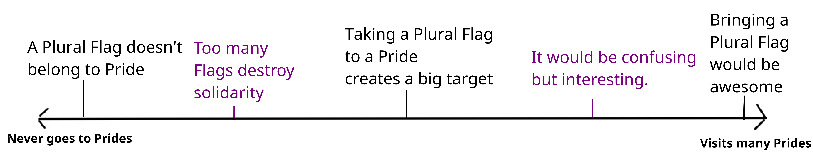

<!--
So I did what any sane person would do and asked the internet.
Well mostly my online friends, but also some plural places as well as offline friends.

Overall I got mixed reactions. The majority thought bringing a Plural Flag would be fine. Interestingly, there further away peeps were from the LGBTQ+ community and prides, the more likely they were against the idea, while peeps who would frequent Prides really encouraged me to do it.

I got some interesting arguments about the spirit and idea of a pride, and I had some good discussions. More than one person mentioned the fear of hostility if I bring a Flag, though that never really happened. I had to make the argument that having terms to define ya own existence is not necissairly the result of evil neo-liberalism.

And quite a few just didn't care.
-->
---

## Conclusion - Who am I gonna please?

<!--
Ultimately, it boiled down to the question

Who am I gonna please?

I could either follow those who want to keep a Pride "pure" and "on-topic"

or

I could give representation to a marginalized group which gets its public image usually from Horror movies.

Phrasing it this way made the decision easy for me.
-->
---

<!--
I absolutely despise gatekeeping.

I wasn't sure yet what would come, or how it would turn out, but I was set to bring that Flag to the Pride.
-->
---

### The Journey

<!--
So first thing I did was mapping out suitable targets for my flag.
Here in Germany, Prides start in late spring and end in late autumn.
The two biggest prides are in cologne and Berlin, but virtually every town with more than a couple thousand inhabitants nowadays has a pride.

So what i did was selecting the ones close around me, and I could have gone to quite a few more prides, but I really had to manage our spoons, more on that later.
-->
---

### The gear

<!--
With the dates set, now the question came up what to bring to a pride.
First was obviously the flag. But then I thought to myself .... what if peeps ask me
about the flag on the Pride? Wouldn't it be nice to have something to give them ... like a flyer?

So I made one. From there it escalated a bit. In the end I had a few different types of buttons, a lot of english and german flyers and stickers (which are not on the picture ... sorry). With that, I was ready for the next step.

*Notes* What would ya like to get on a pride?
-->
---

### The plan

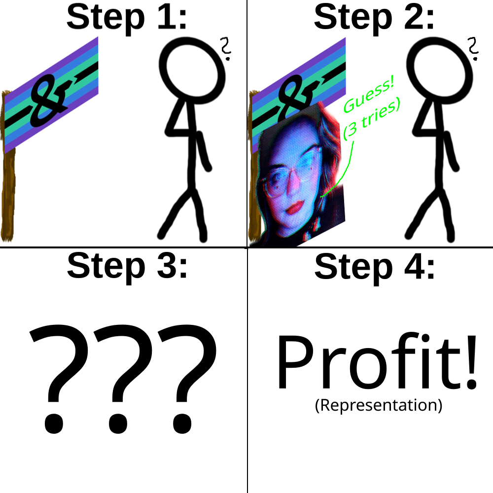

<!--
I had come up with a plan as how to give out the stuff. Its as follows:

1. First, I gonna grap attention by showing peeps a flag they have never seen before.
2. Second, Naturally, they gonna ask me what it means. I gonna tap my shirt and tell them they get a button if they guess correctly
3. Third, I enjoy the pain and terror in their faces as they desperatly try to think of whats in my pants, or who I want in my pants.
4. Fourth, they use up their three attempts and i hand them a flyer with an explanation. They gonna be thankful to learn somethin new bout the world, and if they are nice they still get a button.

An absolutely fool-proof plan and nothin could go wrong.
-->
---

#### The flyer

<!--
The process of the flyer was interesting. I limit myself to A5 and at least 12 points font size. The idea is that a pride is loud and full, so the flyer should give them a quick idea, but not overwhelm them. And if they later choose to do more research, it should contain all important keywords they would need. 

While the end-product isn't perfect, I think I did a pretty good job in giving an overview. I was even able to smuggle in some anti-medicalist views. If ya feel like this flyer is something ya want to share, it is linked in the Github Repository.
-->
---

#### Check your flag

<!-- On the left is the gay pride flag, on the right the plural pride flag i used. While it is both aesthetically and ideologically pleasing, they both have similar colorscheme. Quite a few peeps on pride though I'd be gay, which is kinda weird considering how I present myself. -->
---

#### A5 is to big

*Gif*
<!-- While the size is easy to read, cheap flyers mean low paper density meaning the flyers are very wobbely ... and get destroyed super quick -->
---

#### Magnetic Buttons are a great stimming toy

*Gif*

<!-- If ya never had a magnetic button, I absolutely can suggest getting one ... or a couple of them. They are a great stimming toy and I honestly gave more of them away as that, rather than as a "here is a plural button".-->
---

#### Cologne

<!--
With all my material settled, the plans made, it was time to start goin to a pride.
I started with cologne. Certainly a mighty oponent. in total, over a million peeps visited the pride, 40°C and a 5.5km walk through cologne.-->
---

## Lets go!!!

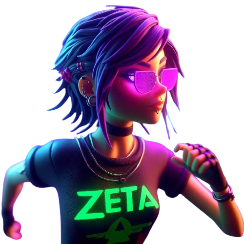
<!-- Nothing could go wrong! -->

---

## It's zeta time

<!--
I arrived there at 10 AM, two hours before the pride was set to start at 12:00.

Originally I wanted to meet with other systems, sadly they couldn't make it. Instead I met a cute couple on the pride with which we stayed until the end.

I had some interesting chat with them, and they were generally interested in things work with sex and gender for plural folks. Glad I met them. For the first few hours we stand on a bridge with the sun frying us. The pride had over 500 trucks and it took them until after 18:00 to get all of them through the 5.5km.

At some point we decided to join the parade. It was fun, I have to admit. We danced around hundreds of peeps in colorful outfits, some with protest signs, some with plush sharks, some just with them self. To very decent german techno.
-->
---

<!--
I understand that there are folks that would rather see the focus "political messages" than to party but I think they are missing the point. We as plurals as well as LGBTQ+ peeps live in a world in there we still have to apologize for our existance. And that is the best case. In this world, celebrating yaself, being happy with how ya are and enjoying things that others do without bounderies, is an act of resistance.

That being said, I wasn't really able to give away any of my stuff. Turns out that in an ocean of colours, a single Plural flag just doesn't get noticed.
-->
---

## The switcheroo

<!-- After quite some dancing and protesting and trying to get something to drink on a sunday in cologne i was pretty done to be quite honest. I wasn't planing at all to switch during the pride, but i guess at some point, I lost control over the body - so brace for my best Jemar impression: -->
---

## Jemar arrives

<!--
Getting outside oin cologne was ... a bit scary. Super many people, and very loud. Jemar knew that zeta made some new friends, so first step was to learn a bit more from them. They were extremly friendly. Jemar understands why zeta choose them as friends. We spend some time together, then Jemar noticed that belt pockets were still super full, so zeta wasn't really able to give a away things. The friends said that zeta just danced around mostly.

That made Jemar thinking ... maybe there is a better way to give away things than just wait for people. Because its probably a bit scary to go to people, and then even more so to play a guess game. To test this out Jemar, gave a way some of the stickers we have. It worked! Everyone was happy to get some, and when they asked what it means, Jemar could just give them a flyer. A good thing that zeta prepard so many things.

Jemar tested it further, and ended up without any more stickers and much less flyers. It was getting already late, so Jemar headed to the central station and took the only train that was able to depart because of Betriebsstörung.
-->
---

## Review

<!-- 
So, what did we learn here?

First, Stickers are really the door opener to get people into conversations. If ya invest into anything, put the money into stickers. Though, a flag is also nice.

The second thing is that a pride is a very loud, bright place. That isn't only an issue for peeps with sensory issues - like some of my headmates, but it also means basically everyones attention is very narrow, because there is just too much. It can be still a fun thing, but it is something to think about.

Third and that is the most disturbing one. As I said, cologne pride had over 500 trucks. Each of them cost over a grand in "sponsoring donations". Yet - they didn't set water stations along the track ... at 40°C. The worst offender on the trucks was Bild Zeitung, a german newspaper which is similar to the Sun newspaper, or Fox News, though a bit less radical in its messaging.
I cannot comprehend why they would sponsor a truck on a Queer Pride walk, it just doesn't make sense to me.

I know organizing a pride is expensive, and with a million atendees even more so. While technically the organizer is a non-profit ... I think we should have a discussion of what commercialization does to a pride - but thats not the topic of this talk.
-->
---

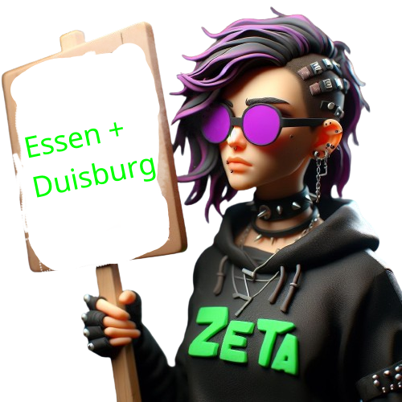

<!--
I put these two together, because they really teached me to respect our spoons.
It was between of some other summer project, so we were pretty drained in general. Gotta say thanks to my headmates for allowing me burning the few left-over spoons we had on dragging myself to those Prides.

I came to Duisburg as a zombie, but was able to connect peeps. I was better rested in Essen, but they pushed a 8 Kilometer route in 90 mintues - why? Nobody knows. Later that day the police denounced some Lesbians of an "illegal gathering" cause the protested in front of an political party booth ... so I guess it might been the police who wanted to be quickly done with it.

It can't be denied that Jemar's tactic of giving out stickers really works wonders, I'd say about 50% who got a sticker asked me what it is about, and basically all of who learned about plurality were positive. Although, those who recognized Plurality usually dropped sentences like "Oh, so its DID?" or "So its the thing from Moonknight?" - I think for next year we have to pull more representation for our endogenic friends.
-->

---

---

<!--
It was very well worth it. I made contact with different people and organizations in the queer scene and learned a bit bout the local queer culture.

TODO: More input what we learned and meet here.
--->
---

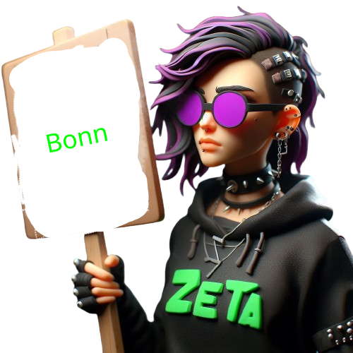

<!--
Bonn was by far the most insightful protest I attended. Instead of a classic Pride-Walk, it was a Mad & Disability Pride. I Joke that it was so inclusive that even the Police was helpful.

I think I surprise noone when I say that Disabled and "Mad" people have to deal with a ton of discrimination, in many ways similar to that of LGBTQ+ People, bad sadly often even more servere. I think thats part what made it so different. On a Pride Walk, i felt welcome. On the Mad + Disability Pride, I felt actively acommodated.

They had printed versions of all speeches and apologized that they couldn't get a sign lang translator, organized bikes for those who couldn't walk well, they made sure everyone was hydrated with free water - heck even the police tried to put us on a route that was acceptable for wheelchair users by asking us about it.

It wasn't a big one, I guess less than a 100 peeps in total, and the route was relatively short. I made a lot of contacts there and peeps where happy to get free infomaterial.

I think every Pride and most protests should aim to achive similar levels of accesibility.
-->
---

---

<!-- Münster was a weird one. I included it here because it highlights that these protests, while often light-hearted and playful, have a pretty miserable reason to exit. Malte was 25 years when he was murderd at the Münster Pride 2022. It was a shock. But sadly it wasn't unexpected.

The walk was somber. No music played, no material was given out. We just marched through the city to shoutout "We are not gone". I didn't achieved anything in my Plural Propaganda Terms, but my presnce was still important.

I'm glad I was there.
-->
---

<!--
After I learned a lot, and gave alot of my Plural Stuff, I was eager to go to the pride in my hometown.

I also want to use this prides to introduce some particular stuff of german pride walks. First, they are usually called "CSD" as in Christopher Street Day. If ya ask who is Christopher, its the street in which the Stonewall riots took place. Why its CSD? I wasn't able to find out.

Another thing that seems way more common now is street fairs which are usually at the end of the protest track. As mentioned before, political parties have booths there, as well as local organizations and shops that sell queer merch. The problem of commercialization applies here too.

Then, on all Prides the LGBTQ+ alphabet was pretty liberal. We got furries, a few different type of kinks, aces and allies, basically anyone who felt brave enough to go on a pride was welcome there.

It had a completely different vibe. In many ways it reminded me of political protests in my youth ... but with more rainbows and better music. We already gave out so much Plural Propaganda, at this point I wasn't to concerned about spreading the message. Though I had a special weapon left.

So I put on my dopest outfit, got in front of a truck and had fun. Of course I met some friends I made, even made one or two new ones. But it was also to unpack the new gear.
-->

---

## Soap Bubbles!

<!-- 
So, ya saw the tunnel on the last picture.
I prepared about 100 small soap bubble dispenser and gave them arround to various peeps, with the instruction to blow them out when we get under the bridge. 

It was awesome. Peeps love soap bubbles, and its another great icebreaker, and it just looks cool when 100 peeps cast rainbow balls. Sadly I dont have a video of it, but I'm set to make one next time.

Overall, great time, its not a big pride in my hometown, or without flaws, but certainly one I enjoy.
-->

---

<!--
Wuppertal was really just to close this Pride summer.
I again met the contacts i made, and it was really more an sitting together, enjoying the last days of summer and promising each other to be there next year. I don't have much else to say about it, other than all of ya should have taken the Schwebebahn at least once in ya life, so now lets get to...
-->
---

## Retrospective

<!-- 
What are things I wanna highlight after six prides?

For one. They are fun if ya let them. It is totally acceptable to party on a Pride, there will be always a crowd available for it and I think its one of the safest spaces to try to dance.

Then. Noone was hostile about me bringing a Plural Flag to the pride. At worst they didn't care, but most actually wanted to know more. It is absolutely not they best place to teach them about the intricacies bout the Plural Life - and the overstimmulation made it very hard to pull out anything coherent to me - but its still a place where peeps can learn somethin new - me included.

Third, its a really good place to create contacts with the local alternative scene. They are often very tightly knitted together - so if ya new to a city and ya want to learn bout the interesting peeps n places, go to a LGBTQ+ Pride.

When it comes how to prepare for a pride, or prepare *a* pride - thats what is part 3 goin to be about.
 -->
---

## Part 2: The Theory

<!-- We still haven't fully answered the "Is it ok to bring a Plural Flag to a Pride Walk?" Question. In this Part I will have a deeper look in different theoretical frameworks, to get a better understanding of what I was doing on those Pride Walks. -->
---

## LGBTQ+ vs. queerness

<!-- 
On first glance, Plurality doesnt appear in any definitions of the LGBTQ+ Alphabet Soup.
-->
---

<!--
Except, there is the letter Q. Queerness often is a standin for all kinds of things, which leads to the question
-->
---

## What is Queerness anyway?

<!-- What exactly is Queerness, anyways? -->
---

<h3>Queer Feminism</h3>

"Gender are like memes, its always fun to make your own."

- Judith Butler, probably

<!-- 
When researching Queerness, one of the first authors to show of is Judith Butler. 
Butler published Gender Trouble in 1990. Its the Book the whole idea of "Performative Gender" is based on...
-->
---

### Gender Trouble - 1990

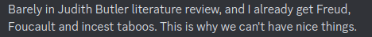

<!-- And the Book is **dense**. I really can't suggest it to anyone who had to fight against a prejudice systems, like the medical one. Not because Butler agrees with them, but because she dismental them, and in order to do that, she spread out all their BS in excruciating detail. -->

---

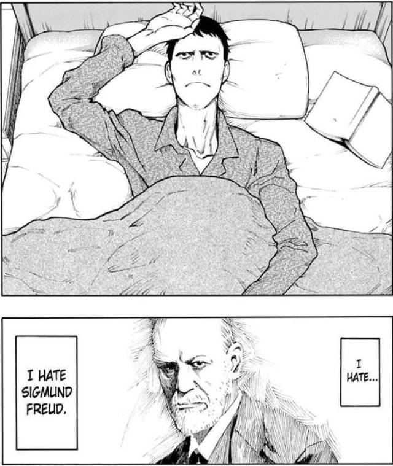

<!-- I have nothing to say on this slide, its just absolutely hilarious.-->
---

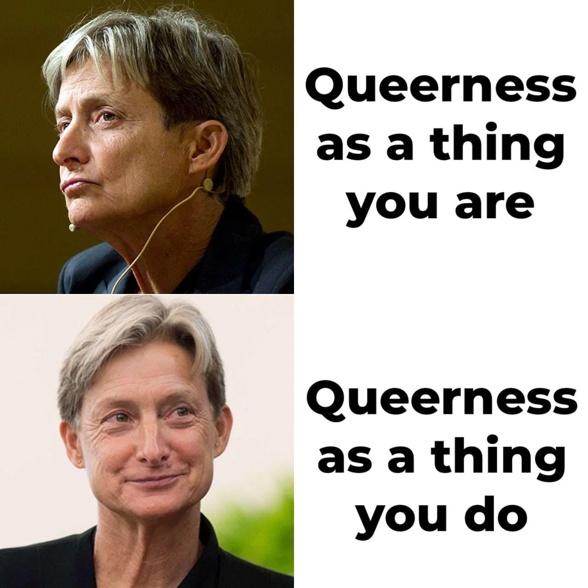

<!-- Nonetheless, Butler brings a lot of important ideas on the table. She focuses mainly on Gender inside the framework of femiistic philosophy, but she is very explicit that Queernes is a matter of Identity, and things like Sexuality or Gender are categories which we use cause everyone understands them. -->

---

<h2 style="margin-top:-5%">Queerness is the lived out experiences and identities that question and violate normative fictition</h2>

<!-- In that regard, Identity is very much a Meme-afair. We use Identity as a shortcut to express Ideas and concepts that we might not even be able to otherwise verbalize. Memes themself are just media, they get their meaning by the ineraction and compound fiction we assign to them. There is a lot of power in deciding what in this interaction is and isn't a Meme, or identity. Queerness tries to break this interaction. It actively invites to reshape and introduce new Memes, not as an opposition to the already existing once, but to question if a pre-defined set of Memes is needed in the first place.

When I go to a pride walk with a Plural Flag, it is Queer not only because being Plural is a pretty queer Form of Existing, but also because it actively asks the Question what is and what isn't allowed on a pride.-->
---

### Disability Pride

<!-- 
Another Book I consulted was "Crip Pride", it brought up a point I was aware but never thought through. Most of the LGBTQ+ letter were or are considered as an illness by the medical system. 

Sadly, the story told in the tweet never happened that way, but it highlights an important point: The gays had to go through the exact same struggles as
-->
---

<h3>Crip Theory, 2006</h3>

"Bodies are the canvas of our identity memes."

- Robert McRuer, probably

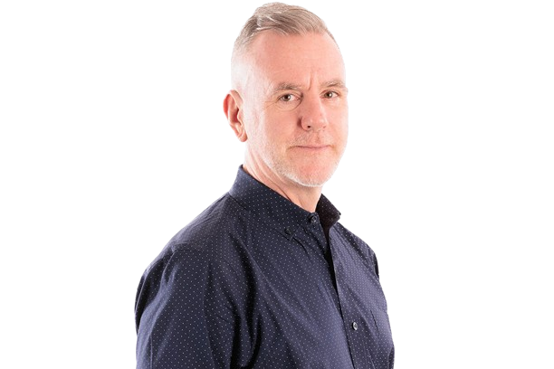

<!--
So there is a lot of similiraties in the structures of oppression between disabled and lgbtq folks. Robert McRuer established in Crip Theory, that the control of bodies - and minds - is in both cases the underlying of powerstructures that lead to things like ableism and homophobia.

And we can examine the dynamics of ableism, and to that extend plural-phobia, with the same tools that are used inside the LGBTQ+ Community. At the same time we can "reflect" the memes we established in disabled communities back to LGBTQ and give them insights of the struggles they face.

There are differences for between ableism and homophobia, but so are there differences between homophobia and transphobia. It begs the question at which point the distinction between the disability and the lgbtq+ movement are based on any material truths - and where it is just another performative repetition we are not aware replicating.

So, for the purpose of this talk I mainly want to emphasize the following:
1. Disability and LGBTQ+ peeps face similar, sometimes the same challenges.
2. The categories we use to fight these inequalities come from an oppressive system, not those who suffer from it. Challeging them is a good idea.
3. There is a lot to learn and understand if those movements start a dialogue with one another.
-->
---

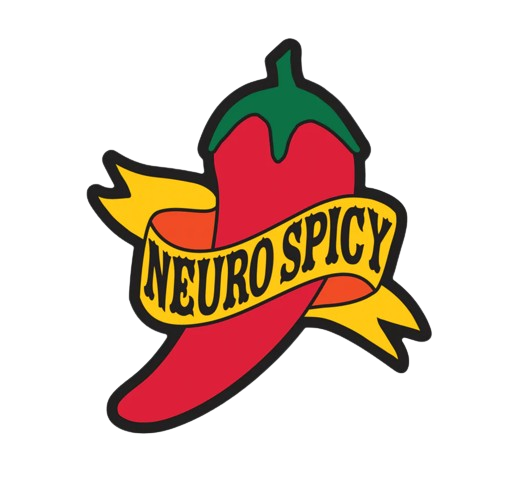

<!--
Not all plural systems are disordered. So we have to introduce another concept to bind things together.

Keen eyes might have spotted that I called plurality part of the neuro-diversity movement. Before ya can critize me for that, we have to establish what neuro-diversity even means.

Which is actually somewhat difficult. We know the term was coined in 1997 by Blume who wrote about online spices. Later Judy Springer picked it up, mainly for the autism community which is still the main user. Then in 2014 Nick Walter tried to properly define it, though its still pretty vague and contested.

For our case, we can define neuro-diverse as the fact that there is no normal brain, each of them is unique. Then, neuro-divergency are types of brains that got stamped by soceity as clinical ill. The Neurodiversity movement tries to break open those solid categories an argues that not all deviance from "normal behaviour" is clinical or bad.

Did ya noticed?
-->

---

<!--
Its perfomative fictition all over again! We again have labels to discriminate peeps that have the need to be repeatly performed because they have now bases to ground on. There is no "normal brain".

So, all the tools that we developed for queer theory apply here too.

The movement is mainly comprised of autism and adhd groups, but there are discussions of other labels, like schizophrenia.

I think that we as a plural community have a lot go gain to put ourselfs into the neuo-divers umbrella. For one, we have a huge problem of plural experiences only accepted if they fit into a clinical model, with overburding evidence that there is much more. For the other, because there is alot of useful discourse inside the neurodiversity movement of what is actually an impairment, and what is an trait they collides with a world of neurotypical fictition.
--->
---

### Social model of disability

<!--
Which brings us to the social model of disability.

Thats a concept that floated around since at least the 1960s, but was codified by Mike oliver in 1983.

The neurodiversity community bases a lot of their ideas on the social model of disability. In short, it redefines impairment and disability. Impairment are actual attributes of a person. Disability refers to the structual dissonance of what a soceity provides, and what a persons structual needs are.
To enable people doesn't need to mean change the persons attributes, but to adjust the soceity to met the needs of those who live in it.

How does it tie into the prideflag? My answer is twofold. Changing society doesn't have to be a top-down affair. We don't have to wait for ramps to be build, we can create them ourselfs.

I don't have a dedicated space for activism as a plural person, the mad + disability pride was the closest I got to. But I can just start doin DIY activism and carve out the space we need.

---
Kick out:
The other point I 

We won't have any support by a medical system, which in large parts still either believe I don't exist, or that my existence should cease through therapy.

This place though, I think is the right breeding ground to ask some hard questions. There are undoubtly disordered systems that need support and therapy. But which of the issues are really once that are intrinsicly harmful, and which are traits of human diversity, which by their own are fine, but create trouble in a soceity not meant for us.

I don't know the answers, but maybe this is the starting point for future discussions.
-->
---

<h3>Critical Theory</h3>

"Questioning memes forced upon us is to question the memes of power."

<li style="align-text:center; margin-left:50px">Theodor Ardono, probably</li>

<!-- 
The last concept i want to introduce in the theoretical section is Critical theory. Critical theory has quite grown since the humble beginnings of Adorno and the Frankfurt School.

Originally it focused on X the horrors of the Nazis. The basic idea is that (social) science shouldn't only observer the world, but critique it, and especially its power-structures and through that improve the conditions of soceity.

That is what we have done the last few minutes. 

Connected to Critical theory is also radicalism which can be understand as the practical execution of the theoratical discourse.

So, bringin a prideflag to a pride is not only queer, but also critical and rad.
-->
---

<!-- 
After all these concept, I think plurality sits in all of them, and neither of them. It is in manyways the breakingpoint between those and it highlights how artificial boundaries might harm us.

Is it queer to be plural? Kinda.
Is plurality an form of disability? Not always, but soceity makes it this way.
Does plurality fall under the umbrella of neurodiversity? I'd say yes, but some does not.
Is plural activism a form of radical protest? I guess.

It is weird coming from a person with Amnesia, but Plurality really breaks down barriers used to seperate all those groups. I think that in the landscape of activism, that makes plurality uniquely valuable.

-->
---

## What to make out of it?

<!--

Keen observers might have noticed, I have mostly quoted books published by academics in this part. This is not because there exist no discourse outside of universities, but because those outside are often more obscure and seen as less reputable. When I asked people for sources of Queernes, they shared Butler, not Blogposts.

And I think we, here in this Plurality Congress, can understand very easily all the negative implications that come when the existing literature is written about you, not by you.

In addition to that, there are two groups that still have a strong hold on discussions inside the LGBTQ+ space. I'd call them elderly gays and white thrid-wave feminists. The first are rich white gay man in the 60s and 70s, the latter rich white woman in their 50s and 60s. Obviously both are stereotypes.

The have a lot of power inside the community, because they are often the ones who founded those spaces and because they can afford to push their ideas. Not because their ideas are especially impactful, nor because they were the most radical, but because they had and have the social capital to safely represent themselfs.

And that is also an issue.
-->
---

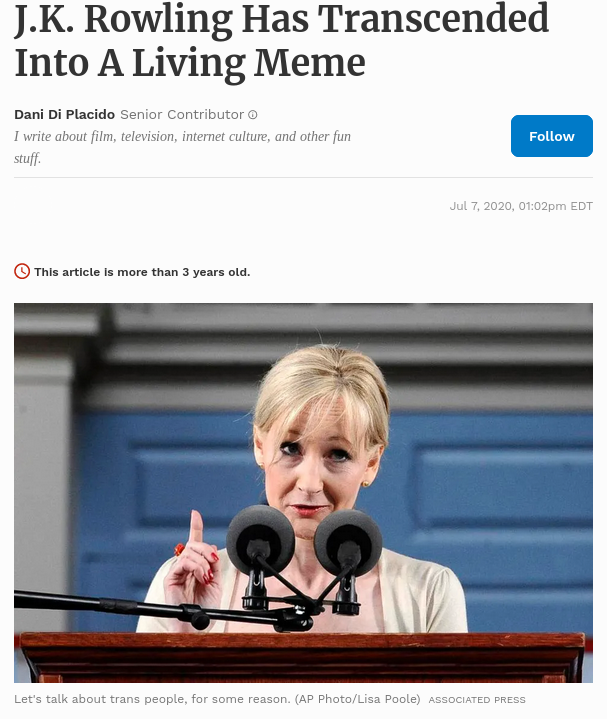

<!--
The easiest to understand example of those would likely J.K. Rowling, as there is no further explanation needed why her stances are problematic.

She is also a good study object to highlight the "social capital" aspect. Rowling is a white, hetero, billionaire with a british passport and a loyal fan-following. It almost doesn't matter how toxic or contrarian her stances will be, she can afford to have them. Her privilege likely contribute to the increase of toxicity of her arguments. 

A computer nerd like us has a lot higher risk of repercussion when we go on the street to demand rights. But it helps to create the "meme" of self-representation, instead of being described by scholars and rich people.
-->
---

## Conclusion: Bringing a Plural Flag to a Pride is hella queer

<!--
The whole goal of my presentation is to encourage other plural people to engage to activism and stand up for their rights. Considering the current power structure and ideas in the discurs, i think that by itself would be already queer.

And I really don't think anyone has to read gender trouble to make a valuable contribution to the conversation of social justice and equality.
-->
---

## Part 3: The Lessons learned

<!-- 
So after we got our theory out of the way ... what did we learn?
-->
---

#### Manage your Energy

Ya& cannot advocate for others, if none is advocating for ya&self.

<!-- 
I mentioned it multiple times already, I was extreme lucky to be able to participate at so many prides, and in turn hog so many spoons. It was only possible because we have a relatively robust spoon-management in place, and everyone else kept their activities at a minimum to enable me goin there. I was very concious to where and when to go, and I accepted that I have limites. I hate it, but without, we would have just burned out after 2 or 3 prides. 

-->
---

### Find allies

They might have resources ya& need.

<!--
Thats another important point. Making contact with other peeps on a Pride is really useful, but what it also does is giving a support network. I can totally understand the fear of going to one, especially in areas that a less safe.

Not being alone helps, in so many ways. Others can safeguard ya, when ya switching for example. And there is a truth in "strength in numbers".

It doesn't stop at a pride though. Havin a access to a button machine from the getgo would have allowed me to make so much more - and better - buttons. There might be information that never get to public channels. There might be locals that give tips bout where to go before or after a pride.

I really want ya all to get to a pride. And I want ya go there together.
-->
---

### Coping Strategies

Having a good plan solves half the troubles.

<!--

- Fronting
- Communication
- Sensory
- Planing
  - Routes
  - Exits
- Safeguards
-->
---

## How to make ya pride accessible?

<!--
Obviously I dont wanna place all the responsibility on the individual. If ya planing to organize a pride, or any other protest for that matter, the following is for ya.
-->
---

### No Accessibility without visibility

<!-- 
It might be a big surprise, but if people in need can't find ways to access a pride, they won't come.
Great example of this was on the pride in $hometown. They had a sign-language translater on the pride for the speeches. Great idea, right? Except that it was advertised nowhere. If I haven't stand around the right corner of a truck with ~50 other peeps, I'd have completely missed that sign-languauge. And it wasn't even for me. For anyone who could have used a translations - there might as well have been none.

I chose this meme cause its somethin most of us with invisible issues can relate to, but it's not that different for visibly disabled people, really. If ya treat accesibility as an afterthought or a checkbox, and place the burden to get it to ones that need it, its destined to fail.
-->
---

### Communication is important

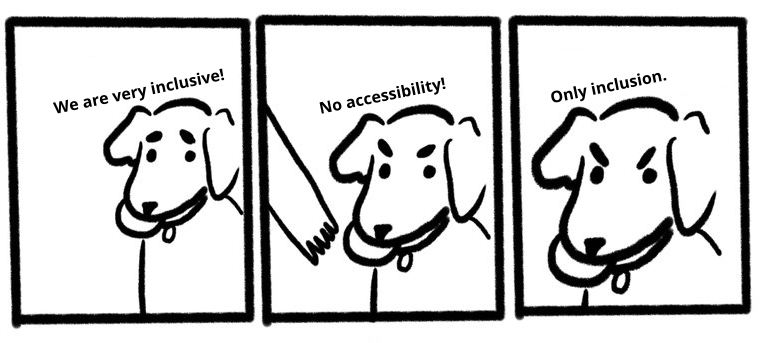

<!--
When ya start thinkin to be more inclusive in ya protest, it needs to be a dialogue. That means ya have to openly communicate what ya can and cannot do, but also just listen to folks what they need. And this needs to go through the whole demonstration, not just the planning phase. A awareness person cannot do much if nobody knows who they are, how to find them, or what they can do. The world isn't perfect, compromises will be needed.
-->
---

Blocks are not just for lego

<!-- 
One of this compromises are blocks. Suprisingly many peeps have mentioned them, when I asked them what would make a pride more accessiable for them. Its not so much about segregation, but about creating an safespace to navigate around.

One very powerful example was another system mentioning peeps running around in BDSM gear. I triggered them to the point they had to leave the pride. Now, Prides should be a place for BSDM folks as much as it should be for Systems. Blocks can help facilitating a compromise. Instead of constantly being at the fear getting triggered, there is one big spot to avoid.

Another example was presented in Bonn. There were peeps with Respiratory issues who couldn't wear masks. There were peeps who absolutely could not risk getting Covid-19. The solution? A dedicated mask block to protect those who need protection.

Blocks on protests are usually seen as a way to group certain interests or isolate trouble makers, but I think they are a powerful tool to allocate help and protection where it is needed. We really should work on establishing plural blocks on prides.
-->
---

### Blitz Round

<ul>
<li>Provide Contact Data</li>
<li>Check the route with wheel chair users and visually impaired folks</li>
<li>Publish your route and speeches upfront</li>
<li>Provide exits and calm spaces</li>
</ul>

<!-- 
Now a list of ideas and leasons I got that are to small to fill a whole slide, but are still useful to consider: 
-->

---

## Go outside and have fun

Nobody is hostile on a pride. If they are, its not a pride.

<!--
We are comming to an end here. I guess this is the point where i can thank all the volunteers making this talk possible, both from the conference, and of course the ones that organized the prides.

Special thanks also go to The Andromeda Constellation, the plentity, Cat, aso, Eden Benet, nolcip and Kay. Thank you for your patience.
-->
---

<!--

I'm glad that i did this Pride Project last year. 

It was a thing I wanted to do. Spending time with my queer, neurodivergent colorful friends is great. But it also created the sense, not just for me, but also those around me, that there is a possibility to normalize plurality. To make it part of the conversation.
-->
---

<!-- If there is one thing I want you to take from this panel its this: We will not achieve recknognition, if we don't occasionally stick our heads out and scream our existance into the world. Cause of that, I really hope that this year, I won't be the only plural flag on a pride. Thanks for listening. -->